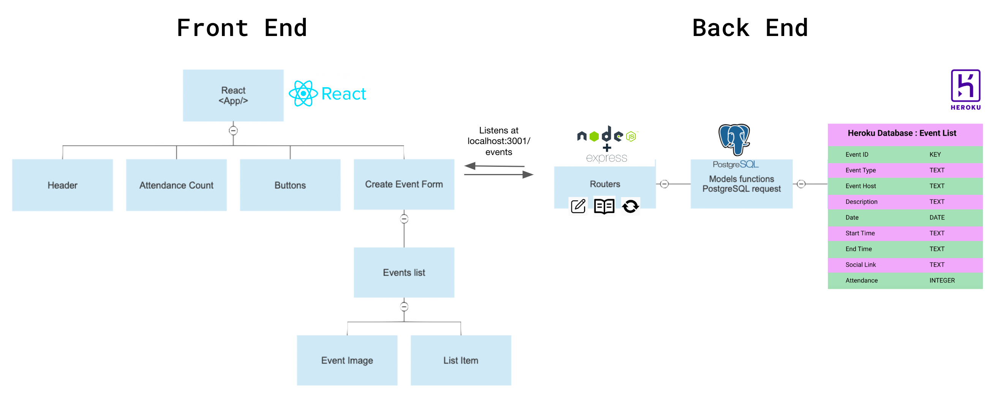
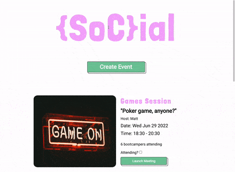
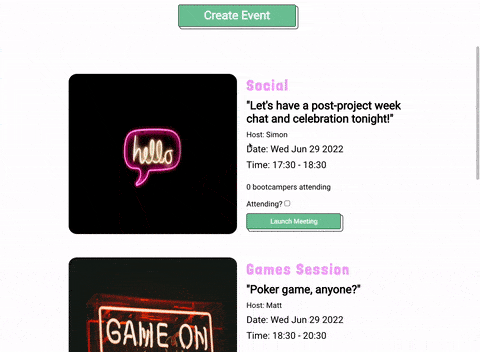
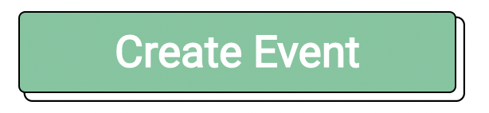
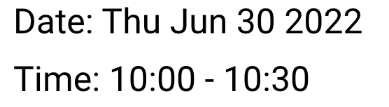

---

This README file provides info for the SoCial app.

To view the back-end code, please click [here](https://github.com/simonpartridge86/SoCial-App-Backend).

---
## Index

* [Project Description](#project-description)
* [Skills & Retrospective](#skills-and-retrospective)
* [Future Plans/Roadmap](#future-plansroadmap)
* [Dev Manual](#dev-manual)
* [App Components Diagram](#app-components-diagram)
* [User Guide](#user-guide)
* [Running Tests](#running-tests)
* [Color and Font References](#color-and-font-references)
* [Support and Feedback](#support-and-feedback)

---
## Project Description

{SoC}ial was created by [Matthew Miller](https://github.com/codedresser), [Simon Partridge](https://github.com/simonpartridge86), [Kunal Shukla](https://github.com/kun-shukla), and [Wanteng Teoh](https://github.com/ten-hub) (Team mishMash) in week 9 of our [School of Code](https://www.schoolofcode.co.uk/) bootcamp. We were challenged to come up with an app to help improve the remote learning experience of our fellow bootcampers in one short week.

After ideating around this theme and identifying existing problems, we ultimately decided to create an app that helps bootcampers more easily create and attend online intra-cohort social events outside bootcamp hours.

As the result, "{SoC}ial" is a single-page React web app that allows bootcampers to create online events for the School of Code community, as well as find and attend events created by other bootcampers.

---

## Skills & Retrospective

This was our first experience as a group on an extended project. This exercise aimed to apply knowledge gained in the first 8 weeks of the School of Code bootcamp, as well as learning and applying the following **skills**:

* Agile methodologies and tools
* Project planning & management
* UX/UI design processes
* Cooperation and decision making in a larger dev team

Having reflected on the project week as a team, we believe that our **strengths** included:
* Creating a strong team manifesto that helped us stay focused and keep momentum during decision-making phases.
* Creating an environment where all team members felt valued and could contribute.
* Designing a realistic and quickly achievable MVP.
* Having regular (twice-daily) stand-up meetings to check in and plan next steps, keeping everyone on the same page.
* Every team member had the opportunity to be involved with each aspect of the project, resulting in an improved sense of understanding and ownership.

Thanks to these strengths, team morale remained high throughout the week and we were able to build an app that fulfilled our original brief and design.

**Lessons** to take forward to future projects:
* Although we wrote tests for the back-end, testing should be given greater priority.
* Programming steps should be broken down and planned in greater detail before starting to code.
* Write questionnaires to test, rather than confirm, our opinions/biases.
* Spend more time on the UX/UI design process.
* Make sure code i as human-readable as possible.
* Be more ambitious regarding stretch goals.

---
## Future Plans/Roadmap
We have planned the following functionality, which will be added to the app in due course:
* User account/login functionality
* Ability for users to edit and delete existing events
* Add Dark Mode and other color blindness modes
* Add Google Calendar/other calendar integration
* Make expired/past events visible on page (rather than filtered out by back end)
* Add filters to avoid misuse/abusive language being inserted into events

---

## Dev Manual

This project has yet to be deployed, but can be run locally using the following instructions:

Clone the project front-end and back-end separately:

```bash
  git clone https://github.com/SchoolOfCode/w9_frontend-project-mismash.git
  git clone https://github.com/SchoolOfCode/w9_backend-project-mismash.git
```

To run the front-end, navigate to the front-end folder and run the following terminal commands:

```bash
  cd social
  npm install
  npm start
```

To run the back-end, navigate to the back-end folder and run the following terminal commands:

```bash
  npm install
  npm run resetTable
  npm run dev
```

The server should run on http://localhost:3001, while the app should run on http://localhost:3000.

### Environment Variables

To run this project, you will need to add the following environment variables to your .env file

```
PGHOST
PGDATABASE
PGUSER
PGPORT
PGPASSWORD
```
---

## App Components Diagram



---
## User Guide

Once you have the back-end server and front-end app up and running, you can use the app as follows:

### Creating an event
Click on the "Create Event" button, fill out all form fields, and then click the "Submit" button (NB. all fields must be completed, and date must not be in the past for submission to work).
Your event should then appear in the event list below the "Create Event" button.



### Viewing/attending events
The list of future events is shown below the "Create Event" button. To register your interest in an event, click the "Attending?" checkbox. To launch an event, click the corresponding "Launch" button, which should open the appropriate meeting link in a new browser window.



---

## Running Tests

### Back-end:
Tests check that all current API requests (GET, POST, PATCH) operate correctly. These can be run in the back-end folder using the following terminal commands:
```bash
npm run resetTable
npm run test
```

### Front-end:

TBD

---

## Color and Font References

| Color                                            | Hex                                         |
| ------------------------------------------------ | --------------------------------------------|
| <span style="color:#74C69D">Project Green</span> | <span style="color:#74C69D">#74C69D</span>  |
| <span style="color:#F4AAFB">Project Pink</span>  | <span style="color:#F4AAFB">#F4AAFB</span>  |

Header font - [Londrina Solid](https://fonts.google.com/specimen/Londrina+Solid) - examples:<br>


Main text font - [Roboto](https://fonts.google.com/specimen/Roboto) - examples: <br>



---

## Support and Feedback

To receive support or give feedback, please contact team members through details provided on their Github profiles:

[@Matthew Miller](https://github.com/codedresser),
[@Simon Partridge](https://github.com/simonpartridge86),
[@Kunal Shukla](https://github.com/kun-shukla),
[@Wanteng Teoh](https://github.com/ten-hub)


[--Return to Index](#index)
